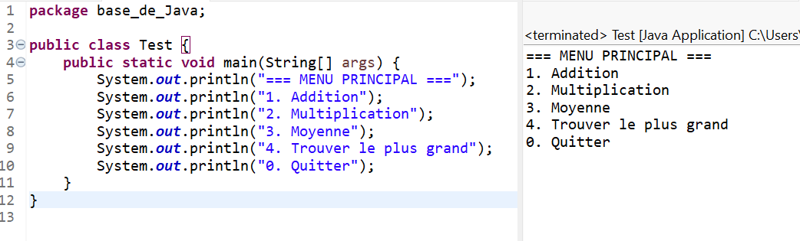
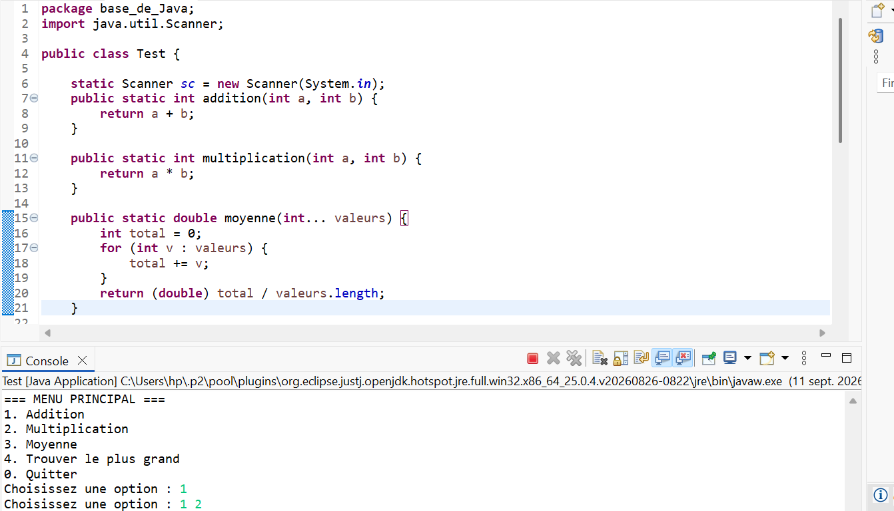
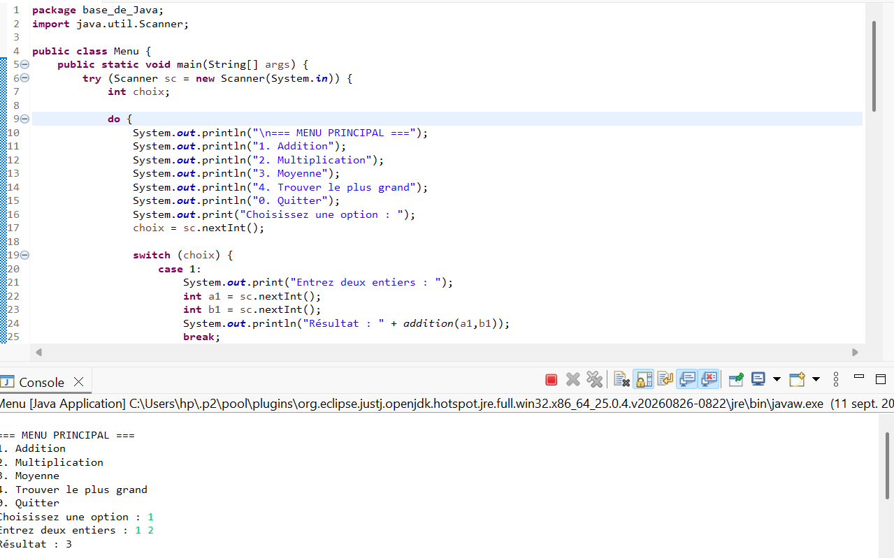

# Menu - TP Java

Programme console en Java qui affiche un menu interactif permettant à l'utilisateur d'effectuer plusieurs opérations mathématiques : addition, multiplication, calcul de moyenne et recherche du plus grand nombre.

---

## Objectifs

- Afficher un menu principal avec plusieurs options
- Lire une saisie utilisateur au clavier avec Scanner
- Structurer le code en méthodes réutilisables
- Utiliser les arguments variables (int...) pour des méthodes flexibles (moyenne, maximum)
- Mettre en place une boucle do-while et une structure switch pour diriger le programme

---

## Étape 1 : Affichage du menu principal

Le programme affiche un menu avec 5 options : addition, multiplication, moyenne, recherche du plus grand, et quitter.

=== MENU PRINCIPAL ===  
1. Addition  
2. Multiplication  
3. Moyenne  
4. Trouver le plus grand  
0. Quitter  
Choisissez une option :  

---

## Étape 2 : Lecture du choix de l'utilisateur

Un objet Scanner lit le choix saisi par l'utilisateur. Cette lecture est placée dans une boucle do-while, qui garantit que le menu s'affiche au moins une fois et se répète tant que l'utilisateur ne saisit pas 0.

---

## Étape 3 : Méthodes de calcul

Chaque opération est encapsulée dans sa propre méthode, ce qui rend le code plus clair et réutilisable.

---

## Étape 4 : Intégration dans le menu (switch)

Le switch relie chaque option du menu à la méthode correspondante, lit les valeurs nécessaires, puis affiche le résultat.

---

## Exemple d'exécution complète

=== MENU PRINCIPAL ===  
1. Addition  
2. Multiplication  
3. Moyenne  
4. Trouver le plus grand  
0. Quitter  
Choisissez une option : 1  
Entrez deux entiers : 10 20  
Résultat : 30  
=== MENU PRINCIPAL ===  
...  
Choisissez une option : 0  
Fin du programme.  
